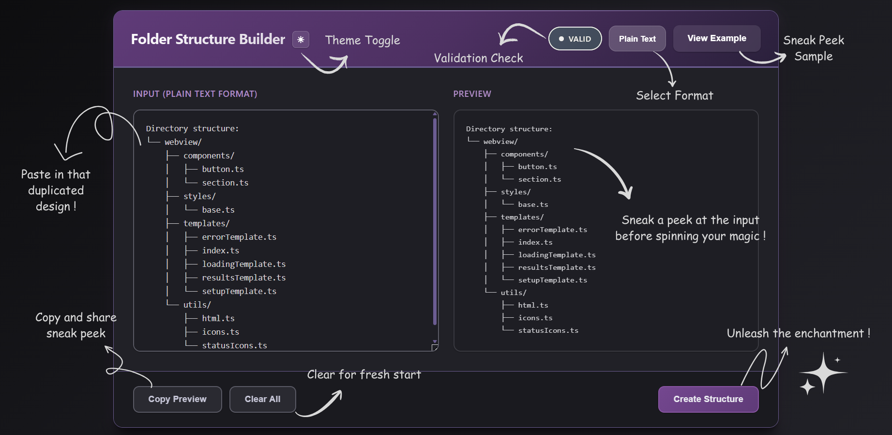
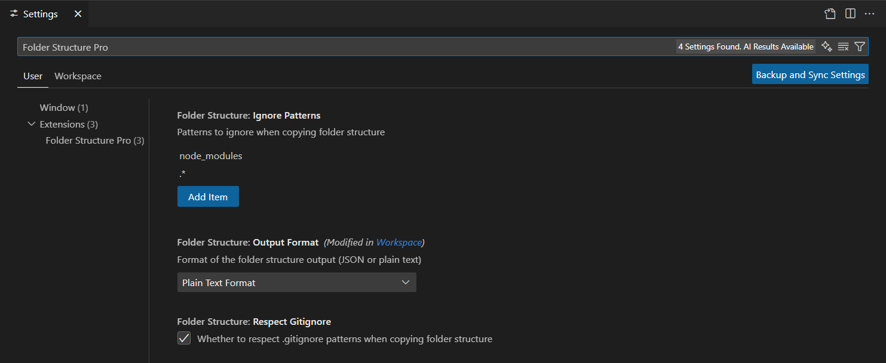
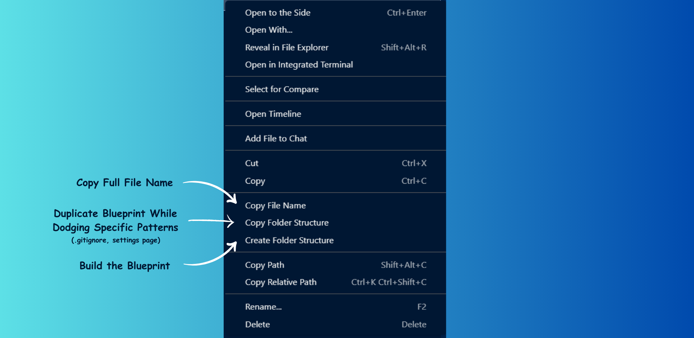

<p align="center">
  <a href="https://marketplace.visualstudio.com/items?itemName=iamshreydxv.copy-folder-structure">
    
  </a>
  <a href="https://marketplace.visualstudio.com/items?itemName=iamshreydxv.copy-folder-structure">
    
  </a>
  <a href="https://marketplace.visualstudio.com/items?itemName=iamshreydxv.copy-folder-structure">
    
  </a>
</p>

<p align="center">
  <strong>🚀 The ultimate VS Code extension for managing folder structures with ease!</strong>
</p>

<hr style="border: 2px solid black; width: 100%; " />

## Table of Contents

- [Features](#features)
- [Quick Start](#quick-start)
- [Settings](#settings)
- [How to Use](#how-to-use)
- [Live Previews](#live-previews)
- [Output Examples](#output-examples)
- [How It Works](#how-it-works)
- [Troubleshooting](#troubleshooting)
- [License](#license)
- [Contact](#contact)

<hr style="border: 2px solid black; width: 100%; " />

## Features



### 📁 Copy Folder Structure

- 🎯 **Two Output Formats**: JSON & Plain Text (GitIngest-style tree)
- 🖱️ **Right-Click Integration**: Easy access from Explorer context menu
- 🙈 **Respects .gitignore**: Automatically excludes ignored files
- ⚡ **Smart Filtering**: Skips node_modules and hidden files

### 🏗️ Create Folder Structure

- 📝 **Multiple Input Formats**: Support for JSON and Plain Text
- 🖥️ **Modern UI**: Live preview, validation, and line numbers
- 🔄 **Smart Handling**: Replace/Skip prompts for existing files
- 🗑️ **Safe Replace**: Sends replaced items to Trash

### 📄 Copy File Name

- ⚡ **One-Click Copy**: Quick file name copying to clipboard
- 🎯 **Simple & Fast**: Right-click any file to copy its name

<hr style="border: 2px solid black; width: 100%; " />

## Quick Start

1. 📥 **Install** the extension from VS Code Marketplace
2. 🖱️ **Right-click** any folder in Explorer
3. 🎯 **Choose** "Copy Folder Structure" or "Create Folder Structure"
4. 🎉 **Done!** Your structure is ready to use

<hr style="border: 2px solid black; width: 100%; " />

## How to Use

### 📁 Copy Folder Structure

1. 🖱️ Right-click a folder in VS Code Explorer
2. 📋 Select **"Copy Folder Structure"**
3. 📄 Structure is copied to clipboard in your preferred format (JSON/Plain Text)

### 🏗️ Create Folder Structure

1. 🖱️ Right-click in Explorer **OR** use Command Palette (`Ctrl+Shift+P`)
2. 🎯 Choose **"Create Folder Structure"**
3. 📂 Select the target directory
4. 📝 Choose format and paste your structure
5. ✨ Click **Create** and watch the magic happen!

### 📄 Copy File Name

- 🖱️ Right-click any file → 📋 **"Copy File Name"**

<hr style="border: 2px solid black; width: 100%; " />

## Settings

Configure the extension to work exactly how you want:

- 📄 **outputFormat**: Choose between JSON Format or Plain Text Format
- 🚫 **ignorePatterns**: Specify patterns to ignore when copying structures
- 🙈 **respectGitignore**: Honor .gitignore rules (recommended: enabled)

### 🎛️ Settings Preview



<hr style="border: 2px solid black; width: 100%; " />

## Live Previews

### 🖱️ Context Menu Integration



### 📄 Copy File Name in Action


### 🏗️ Create Folder Structure

#### 💼 Common Usage


#### 🔗 With Git Ingest Integration


<hr style="border: 2px solid black; width: 100%; " />

## Output Examples

### 🗂️ JSON Format

Perfect for programmatic use - files are represented as type strings:

```json
{
    "app": {
        "api": {
            "analyze-typography": {
                "route": "ts"
            }
        },
        "favicon": "ico",
        "globals": "css",
        "layout": "tsx",
        "page": "tsx"
    }
}
```

### 🌳 Plain Text Format

Human-friendly GitIngest-style tree structure:

```
Directory structure:
└── app/
    ├── api/
    │   └── analyze-typography/
    │       └── route.ts
    ├── favicon.ico
    ├── globals.css
    ├── layout.tsx
    └── page.tsx
```

### 📝 Plain Text Rules:

- ✅ First line is treated as a header (can contain any text)
- 🔗 Every line must use tree connectors (`├──` or `└──`)
- 📁 Exactly one root directory ending with `/`
- 📏 Consistent indentation (increases by one level each time)
- ⚠️ Invalid lines are highlighted; confirmation required if errors exist

<hr style="border: 2px solid black; width: 100%; " />

## How It Works

### 📁 Copy Folder Structure

1. 🔍 **Scans** the selected folder intelligently
2. 🙈 **Respects** .gitignore and exclude patterns
3. 🚫 **Filters out** node_modules and hidden files automatically
4. 📋 **Copies** structure in your chosen format (JSON or Plain Text)

### 🏗️ Create Folder Structure

1. 📖 **Reads** input from the modern webview interface
2. ✅ **Validates** and parses structure (JSON or Plain Text)
3. ⚠️ **Prompts** for Replace/Skip when items already exist
4. ✨ **Generates** folders and files safely (no accidental overwrites)

### 📄 Copy File Name

1. 🖱️ **Right-click** any file in Explorer
2. 📋 **Copies** the file name directly to clipboard

<hr style="border: 2px solid black; width: 100%; " />

## Troubleshooting

### ❓ Common Issues & Solutions:

**🚫 No Option in Context Menu**

- 🔄 **Solution**: Reload VS Code (`Ctrl+Shift+P` → "Reload Window")

**📋 Clipboard Not Working**

- 🔐 **Solution**: Check system clipboard permissions

**❌ Input Error (Create Function)**

- 📝 **Solution**: Ensure input follows correct JSON or Plain Text format

**📄 Copy File Name Not Working**

- 📁 **Solution**: Make sure you've selected a valid local file (not a folder)

<hr style="border: 2px solid black; width: 100%; " />

## License

MIT License — see [LICENSE](./LICENSE) for details

<hr style="border: 2px solid black; width: 100%; " />

## Contact

🐛 **Found a bug?** 🚀 **Have a feature request?**

Open an issue on our [GitHub repository](https://github.com/ShreyPurohit/folder-structure-pro-vscode/issues)

<hr style="border: 2px solid black; width: 100%; " />

<p align="center">
  <strong>Made with ❤️ for developers worldwide 🌍</strong>
</p>

> ⭐ If this extension helped you, please consider giving it a star on the [GitHub](https://github.com/ShreyPurohit/folder-structure-pro-vscode/) and marketplace!
