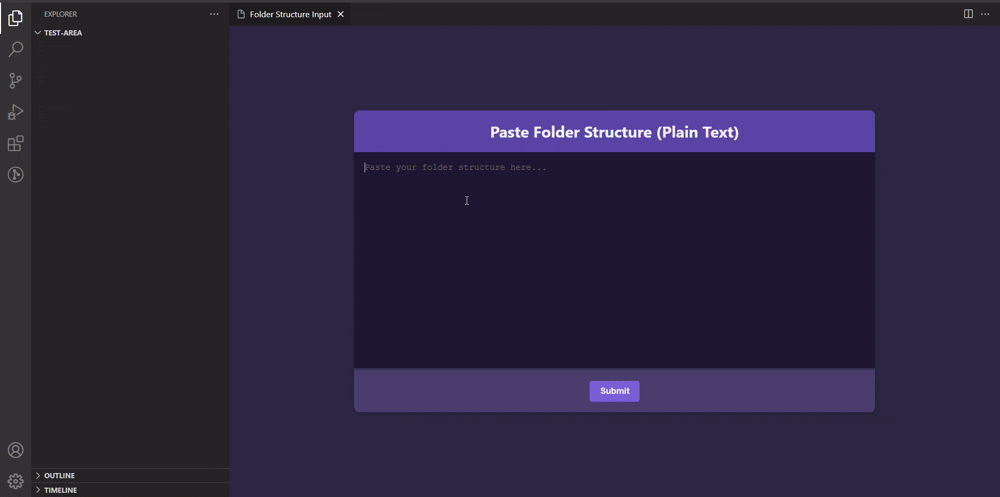

## Table of Contents
- [Features](#features)
- [Usage](#usage)
- [Preview](#preview)
- [How It Works](#how-it-works)
- [Troubleshooting](#troubleshooting)
- [License](#license)
- [Contact](#contact)

## Features:
- **Copy Folder Structure** to clipboard:
  - Supports two **output formats**: 
    - **JSON Format** (default)
    - **Plain Text Format** (GitIgnest-style tree structure, LLM-friendly)
  - **Right-click** context menu in **Explorer** for quick access
  - Automatically **ignores files and folders** specified in `.gitignore` (e.g., `node_modules`)

- **Create Folder Structure**:
  - Create a folder structure from user-provided input in two formats:
    - **JSON Format**: Parses JSON input and generates directories/files.
    - **Plain Text Format**: Parses a GitIgnest-style tree structure (LLM-compatible) to create folders and files.
  - Includes **input validation** to ensure proper formatting.

- **Copy File Name**:
  - **Right-click** a file in **Explorer** to copy its name to the clipboard.
  - Works only for **local files** and provides feedback when successful or in case of error.

## Usage:

### Copy Folder Structure:
1. **Right-click a folder** in **Explorer** and select **Copy Folder Structure**.
2. Alternatively, open the **Command Palette** (`Ctrl+Shift+P`) and search for **Copy Folder Structure**.

### Create Folder Structure:
1. **Right-click a folder** in **Explorer** and select **Create Project Using Folder Structure**.
   - Alternatively, open the Command Palette (`Ctrl+Shift+P`) and search for **Create Project Using Folder Structure**.
2. Enter the target directory path where the structure should be created.
3. Choose the input format (`JSON` or `Plain Text`).
4. Provide the folder structure input (e.g., from **Copy Folder Structure**) in the UI editor and click **Submit**.

### Copy File Name:
1. **Right-click a file** in **Explorer** and select **Copy File Name**.
2. Alternatively, open the **Command Palette** (`Ctrl+Shift+P`) and search for **Copy File Name**.

## Settings:
- **outputFormat**: Choose between:
  - `JSON Format`
  - `Plain Text Format`
- Modify this setting in **Settings** (`Ctrl+,`) under `folderStructure`.

## Preview:

#### Settings:


#### Context Menu:


#### Copy File Name:


#### Create Folder Structure:



### Copy Folder Structure Output:
- **JSON Format**:
    ```json
    {
      "app": {
        "index.js": null,
        "hello.js": null
      },
      "test": {
        "test.ts": null
      }
    }
    ```
- **Plain Text Format** (GitIgnest-style, LLM-friendly):
    ```
    Directory structure:
    └── project/
         ├── app/
         │    ├── index.js
         │    └── hello.js
         └── test/
              └── test.ts
    ```

## How It Works:
### Copy Folder Structure:
1. Scans the folder structure, respecting `.gitignore` files.
2. Excludes files like `node_modules` and hidden files by default.
3. Copies the structure to the clipboard in the selected format:
   - JSON: Standard hierarchical object representation
   - Plain Text: GitIgnest-style format that's easily readable by both humans and LLMs

### Create Folder Structure:
1. Reads user input from the provided webview.
2. Validates and parses the input (`JSON` or `Plain Text`).
3. Generates folders and files in the specified target directory.

### Copy File Name:
1. Right-click a file in the **Explorer**.
2. Copies the file name to the clipboard.
3. Supports only **local files** and provides feedback on success or error (e.g., file inaccessible, permission denied).

## Troubleshooting:
- **No Option in Context Menu**: Reload VS Code (`Ctrl+Shift+P` → `Reload Window`).
- **Clipboard Not Working**: Check system permissions.
- **Input Error (Create)**: Ensure the input follows the required JSON or Plain Text format.
- **Copy File Name Not Working**: Ensure a valid, accessible file is selected.

## License:
This project is licensed under the MIT License - see the [LICENSE](./LICENSE) file for details.

## Contact:
For questions or feedback, open an issue on the [GitHub repository](https://github.com/ShreyPurohit/copy-folder-structure-vscode/issues).