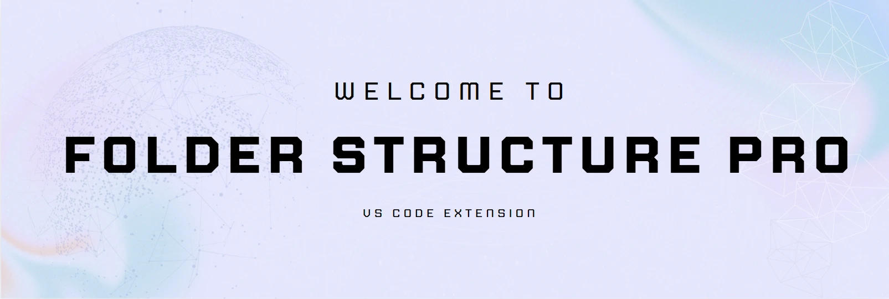
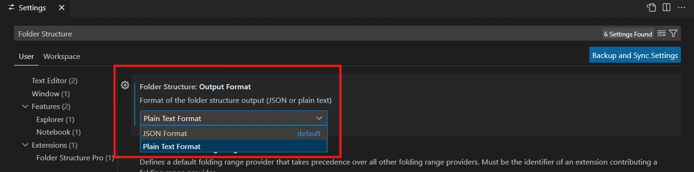
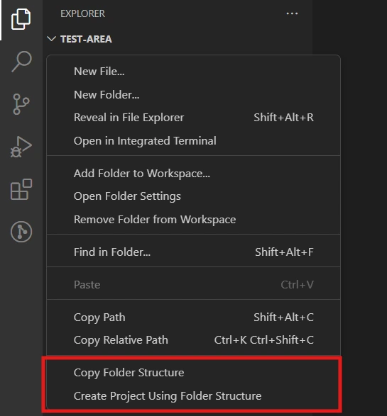
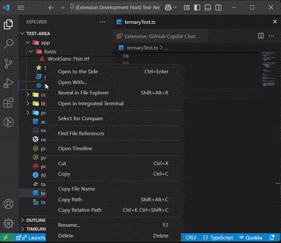
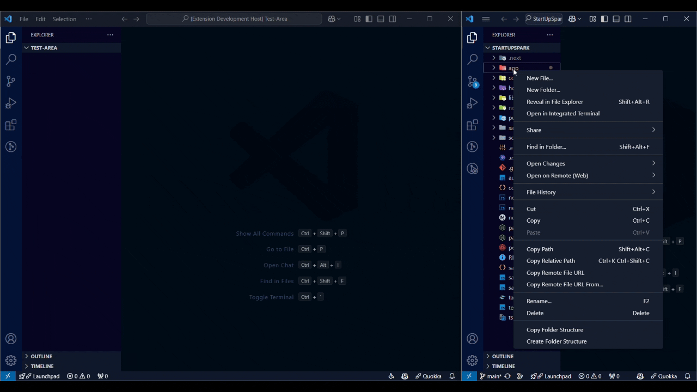
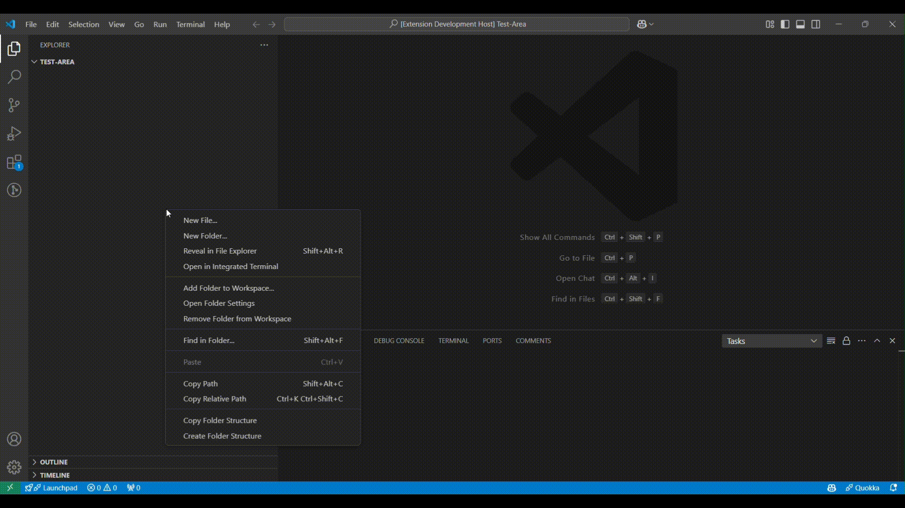

## Table of Contents
- [✨ Features](#features)
- [🚀 Quick Start](#quick-start)
- [📖 Detailed Usage](#detailed-usage)
  - [Copy Folder Structure](#copy-folder-structure)
  - [Create Folder Structure](#create-folder-structure)
  - [Copy File Name](#copy-file-name)
- [⚙️ Settings](#settings)
- [📸 Preview](#preview)
  - [Setting](#settings-1)
  - [Context Menu](#context-menu)
  - [Copy File Name](#copy-file-name-2)
  - [Create Folder Structure](#create-folder-structure-2)
    - [Common Usage](#common-usage)
    - **[Usage With Git Ingest](#with-git-ingest)**
- [🔍 How It Works](#how-it-works)
- [❓ Troubleshooting](#troubleshooting)
- [📄 License](#license)
- [📬 Contact](#contact)

## ✨ Features
- **Copy Folder Structure** 📋
  - **Two Output Formats**:
    - 🌳 **Plain Text Format** (GitIgnest-style tree structure) (default)
    - 📝 **JSON Format**
  - Right-click menu integration
  - Smart `.gitignore` handling

- **Create Folder Structure** 🏗️
  - Support for both JSON and Plain Text formats
  - Interactive UI with examples
  - Input validation

- **Copy File Name** 📎
  - Quick file name copying
  - Error handling and feedback

## 🚀 Quick Start
1. Install the extension
2. Right-click any folder in Explorer
3. Choose "Copy Folder Structure" or "Create Project Using Folder Structure"

## 📖 Detailed Usage

### Copy Folder Structure
1. **Right-click** a folder in Explorer
2. Select **Copy Folder Structure**
3. Structure is copied in your preferred format (JSON/Plain Text)

### Create Folder Structure
1. **Right-click** in Explorer or use Command Palette
2. Choose **Create Folder Structure**
3. Enter target directory
4. Select format and paste structure
5. Click Submit

### Copy File Name
- Right-click any file
- Select **Copy File Name**

## Usage:

### Copy Folder Structure:
1. **Right-click a folder** in **Explorer** and select **Copy Folder Structure**.
2. Alternatively, open the **Command Palette** (`Ctrl+Shift+P`) and search for **Copy Folder Structure**.

### Create Folder Structure:
1. **Right-click a folder** in **Explorer** and select **Create Project Using Folder Structure**.
   - Alternatively, open the Command Palette (`Ctrl+Shift+P`) and search for **Create Project Using Folder Structure**.
2. Enter the target directory path where the structure should be created.
3. Choose the input format (`JSON` or `Plain Text`).
4. Provide the folder structure input (e.g., from **Copy Folder Structure**) in the UI editor and click **Submit**.

### Copy File Name:
1. **Right-click a file** in **Explorer** and select **Copy File Name**.
2. Alternatively, open the **Command Palette** (`Ctrl+Shift+P`) and search for **Copy File Name**.

## Settings:
- **outputFormat**: Choose between:
  - `JSON Format`
  - `Plain Text Format`
- Modify this setting in **Settings** (`Ctrl+,`) under `folderStructure`.

## Preview:

### Settings:


### Context Menu:


### Copy File Name:


### Create Folder Structure:

##### Common Usage:


##### With Git Ingest:


### Copy Folder Structure Output:
- **JSON Format**:
    ```json
    {
      "app": {
        "index.js": null,
        "hello.js": null
      },
      "test": {
        "test.ts": null
      }
    }
    ```
- **Plain Text Format** (GitIgnest-style, LLM-friendly):
    ```
    Directory structure:
    └── project/
         ├── app/
         │    ├── index.js
         │    └── hello.js
         └── test/
              └── test.ts
    ```

## How It Works:
### Copy Folder Structure:
1. Scans the folder structure, respecting `.gitignore` files.
2. Excludes files like `node_modules` and hidden files by default.
3. Copies the structure to the clipboard in the selected format:
   - JSON: Standard hierarchical object representation
   - Plain Text: GitIgnest-style format that's easily readable by both humans and LLMs

### Create Folder Structure:
1. Reads user input from the provided webview.
2. Validates and parses the input (`JSON` or `Plain Text`).
3. Generates folders and files in the specified target directory.

### Copy File Name:
1. Right-click a file in the **Explorer**.
2. Copies the file name to the clipboard.
3. Supports only **local files** and provides feedback on success or error (e.g., file inaccessible, permission denied).

## Troubleshooting:
- **No Option in Context Menu**: Reload VS Code (`Ctrl+Shift+P` → `Reload Window`).
- **Clipboard Not Working**: Check system permissions.
- **Input Error (Create)**: Ensure the input follows the required JSON or Plain Text format.
- **Copy File Name Not Working**: Ensure a valid, accessible file is selected.

## License:
This project is licensed under the MIT License - see the [LICENSE](./LICENSE) file for details.

## Contact:
For questions or feedback, open an issue on the [GitHub repository](https://github.com/ShreyPurohit/copy-folder-structure-vscode/issues).